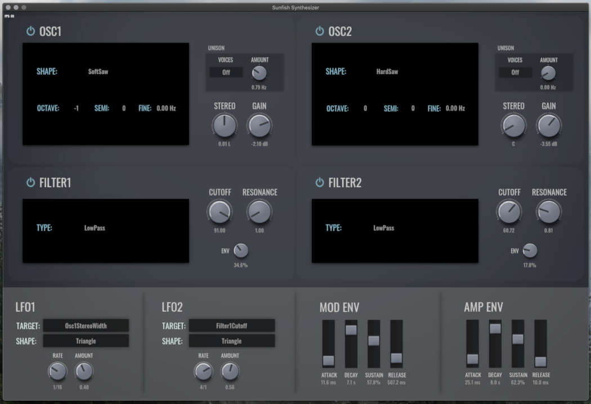

# Sunfish

A work-in-progress pure Rust VST synthesizer.

## Features

* Band-limited waveforms to minimize aliasing.
* Simple low-pass, high-pass, and band-pass filtering.
* 2 LFOs.
* GPU-accelerated interface for smooth 60 FPS rendering.

> :warning: **Warning:** We recommend against using this in any projects as there are plans to revamp the filters, LFOs, and parameter handling -- it's very likely that your projects will break!
